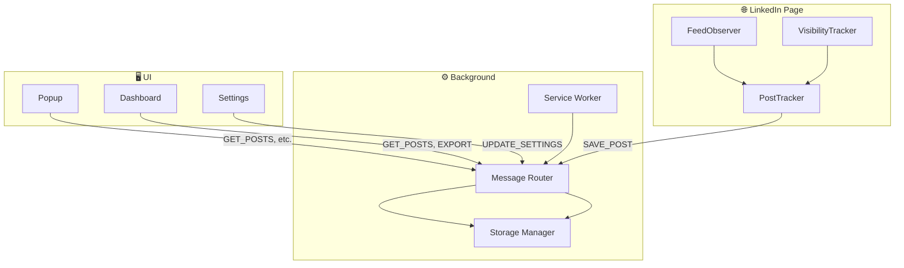

<div align="center">

# LinkedIn Attention Tracker

**Track what you read. Save what matters.**

[](https://chrome.google.com/webstore)
[]()
[]()
[](https://opensource.org/licenses/MIT)

*A Chrome Extension that automatically saves LinkedIn posts you spend time reading — with dwell tracking, attention scores, and export.*

<br>

[Quick Start](#-quick-start) • [Features](#-features) • [Screenshots](#-screenshots) • [Documentation](#-documentation)

<br>

> 🤖 *This tool was AI generated.*

</div>

---

## 🚀 Quick Start

<div align="center">

**Get running in 60 seconds**

</div>

```bash
git clone https://github.com/MohammadYahya871/linkedin-attention-tracker.git
cd linkedin-attention-tracker
npm install && npm run build
```

Then: **`chrome://extensions/`** → toggle **Developer mode** → **Load unpacked** → select this folder.

<table>
<tr>
<td width="50%">

**✅ Verify it works**

1. Visit [linkedin.com/feed](https://www.linkedin.com/feed)
2. Scroll and read a post for 10+ seconds
3. Click the extension icon → see your stats

</td>
<td width="50%">

**🛠️ Development**

```bash
npm run watch
```

Reload the extension in Chrome after each change.

</td>
</tr>
</table>

---

## ✨ Features

<table>
<tr>
<td width="33%" valign="top">

### 📊 Tracking
- **Auto-save** posts you read (configurable dwell time)
- **Dwell time** per post
- **Visibility %** (how much was in viewport)
- **Scroll speed** tracking
- **Attention score** formula

</td>
<td width="33%" valign="top">

### 🖼️ Capture
- Optional **screenshots** when saving
- **Manual save** (`Alt+Shift+S`)
- **Manual screenshot** (`Alt+Shift+C`)
- Pause/resume tracking

</td>
<td width="33%" valign="top">

### 📁 Dashboard
- Search & filter posts
- Sort by date, dwell time, score
- Export **JSON / CSV / Markdown**
- Delete individual posts
- Auto-export option

</td>
</tr>
</table>

---

## 📸 Screenshots

> 📌 *Add screenshots of the popup, dashboard, and settings here. Example:*
>
> ``  
> ``

---

## 📖 Documentation

<details>
<summary><b>📋 Table of Contents</b></summary>

- [Installation](#-installation)
- [Configuration](#-configuration)
- [Keyboard Shortcuts](#-keyboard-shortcuts)
- [Architecture](#-architecture)
- [Build & Development](#-build--development)
- [Data Model](#-data-model)
- [Troubleshooting](#-troubleshooting)

</details>

---

### 📥 Installation

| Step | Action |
|------|--------|
| 1 | **Node.js 18+** required |
| 2 | `npm install && npm run build` |
| 3 | Chrome → `chrome://extensions/` → **Load unpacked** |
| 4 | Select the project folder |

Build output goes to the project root (no `dist/`). The extension loads from this directory.

---

### ⚙️ Configuration

Open **Settings** from the extension popup. All settings persist in Chrome storage.

| Setting | Range | Default |
|---------|-------|---------|
| Dwell time threshold | 3–120 sec | 10 |
| Enable screenshots | on/off | off |
| Max stored posts | 50–2000 | 500 |
| Auto export | on/off | off |
| Export format | json / csv / markdown | json |

---

### ⌨️ Keyboard Shortcuts

| Shortcut | Action |
|----------|--------|
| `Alt+Shift+S` | Save current post |
| `Alt+Shift+D` | Open dashboard |
| `Alt+Shift+P` | Pause/resume tracking |
| `Alt+Shift+C` | Capture screenshot |

*Customize in Chrome: **Extensions** → **Keyboard shortcuts***

---

### 🏗️ Architecture



<details>
<summary><b>📁 File structure</b></summary>

```
linkedin-attention-tracker/
├── manifest.json
├── src/
│   ├── background/     # Service worker, storage, messaging
│   ├── content/        # Feed observer, visibility tracker, post tracker
│   ├── models/         # PostRecord, settings
│   ├── utils/          # DOM helpers, debounce, logger
│   ├── ui/             # Popup, dashboard, settings
│   └── shortcuts/
├── scripts/            # Build scripts
├── assets/ & icons/
└── [build output: background/, content/, ui/, etc.]
```

</details>

<details>
<summary><b>📦 Module overview</b></summary>

| Module | Role |
|--------|------|
| `serviceWorker.ts` | Entry point, commands, screenshots |
| `storageManager.ts` | chrome.storage, CRUD, pruning |
| `messageRouter.ts` | Content ↔ popup ↔ background |
| `contentScript.ts` | Main content entry |
| `feedObserver.ts` | MutationObserver + periodic scan |
| `visibilityTracker.ts` | IntersectionObserver, dwell, scroll speed |
| `postTracker.ts` | Threshold logic, PostRecord, save |
| `domHelpers.ts` | LinkedIn DOM selectors |

</details>

---

### 🔧 Build & Development

| Script | Description |
|-------|-------------|
| `npm run build` | Full build |
| `npm run watch` | Watch mode (ts + css) |
| `npm run clean` | Remove build output |
| `npm run icons` | Regenerate icons from `assets/icon-source.jpg` |

---

### 📐 Data Model

```typescript
interface PostRecord {
  id: string;
  authorName: string;
  authorProfile: string;
  content: string;
  seenAt: string;           // ISO
  dwellTimeSeconds: number;
  visibilityPercent: number;
  scrollSpeed: number;
  postUrl: string;
  screenshot?: string;       // Base64
  attentionScore: number;    // dwell × visibility / scrollSpeed
}
```

---

### 🔍 Troubleshooting

<details>
<summary><b>Posts not being saved?</b></summary>

- ✅ You're on `linkedin.com`
- ✅ Tracking isn't paused (`Alt+Shift+P`)
- ✅ Dwell threshold isn't too high (try 5 sec for testing)
- ✅ DevTools Console shows: `LinkedIn Attention Tracker content script initialized`

</details>

<details>
<summary><b>LinkedIn changed their DOM?</b></summary>

Update selectors in:
- `src/utils/domHelpers.ts`
- `src/content/feedObserver.ts`

Key selectors: `[data-urn]`, `.feed-shared-update-v2`, `.feed-shared-actor__name`, `.feed-shared-text`

</details>

<details>
<summary><b>Build fails?</b></summary>

```bash
npm run clean
npm install
npm run build
```

</details>

---

## 🛠️ Tech Stack


---

<div align="center">

**License:** [MIT](LICENSE)

</div>
